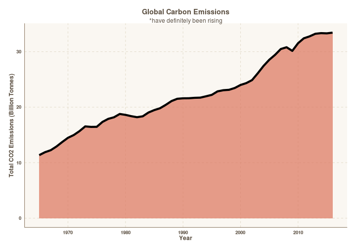
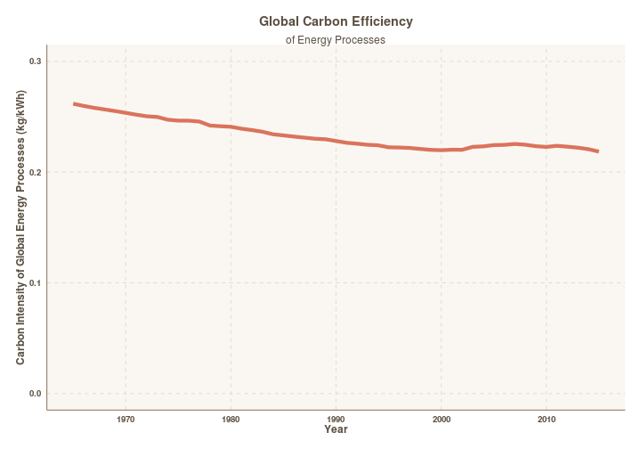
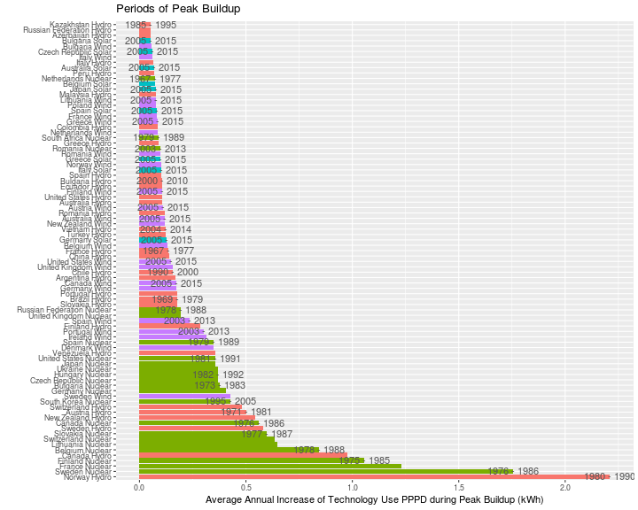
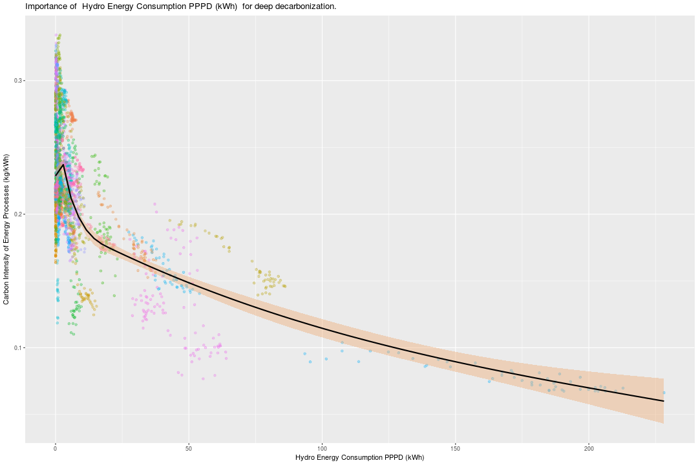
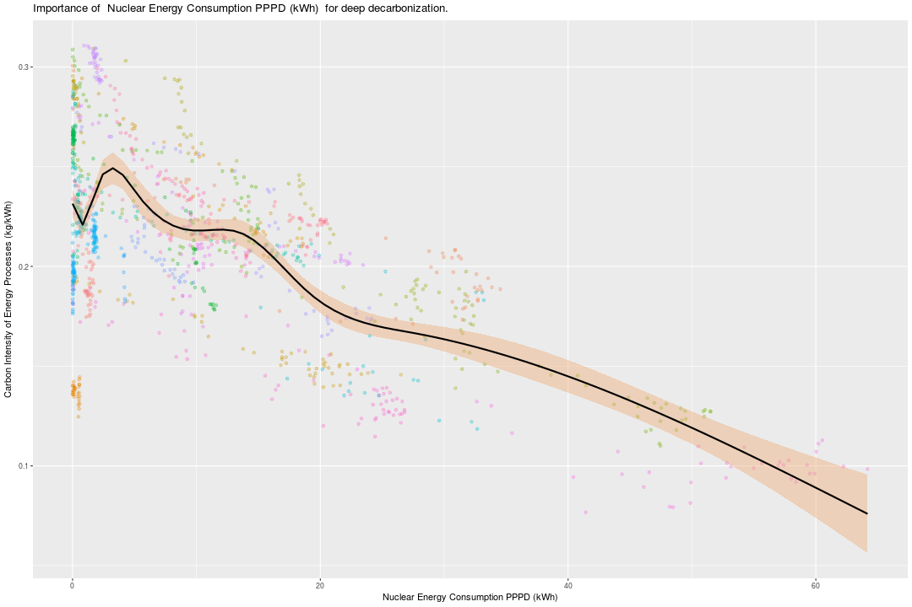
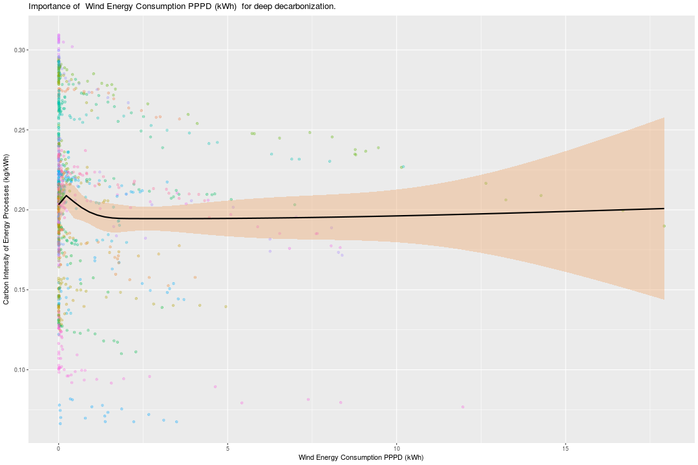
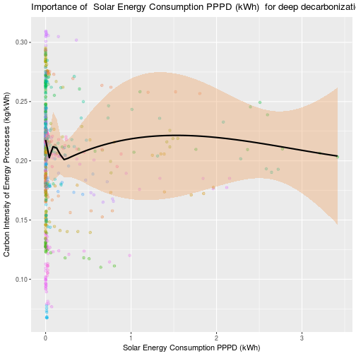

# Deep Decarbonization 
## Unpacking what it takes to save the environment.
<script src="http://ajax.googleapis.com/ajax/libs/jquery/3.2.1/jquery.min.js"></script>
<style type="text/css">
body {background-color:transparent;}
</style>
---
A study by Environmental Progress

<i> Arun Ramamurthy </i>


--- &vertical
# The Motivation

***
## The Background
With climate change as apparent as ever, world leaders have all come together to place some goals ...

***
In Korea, <p class="fragment grow"> <span style="color:green; font-weight:bold"> ... 314 fewer MMT CO2 emitted per year by 2030 </span> </p>

In the US,  <p class="fragment grow"> <span style="color:green; font-weight:bold"> ... 200 fewer MMT CO2 emitted per year by 2030 </span> </p>

In France,  <p class="fragment grow"> <span style="color:green; font-weight:bold"> ... 353kg fewer CO2 emitted per year by 2050 </span> </p>

 
<p class = "fragment fade-in"> 
<i style="color:darkred"> 
Sounds great, doesn't it? 
</i>
</p>

--- &vertical
## The Problem


***
### And even when accounting for energy use... 

<iframe width="900" height="800" seamless src=https://plot.ly/~arun-ramamurthy/13/></iframe>

***
### We haven't gotten much better at that either.


***
## The Solutions


--- &vertical
### Now, how do we make our electricity and energy more carbon-efficient? 
<p class = "fragment fade-in"> But first, a detour in what the rest of the world is up to... </p>

***

<iframe width="900" height="800" seamless src=https://plot.ly/~arun-ramamurthy/17/></iframe>

***

<iframe width="900" height="800" seamless src=https://plot.ly/~arun-ramamurthy/19/></iframe>

***

<iframe width="900" height="800" seamless src=https://plot.ly/~arun-ramamurthy/21/></iframe>

--- &vertical
### So, different countries clearly have different energy policies. Let's evaluate them.

***


***

<iframe width="900" height="800" seamless src=https://plot.ly/~arun-ramamurthy/15/></iframe>

--- &vertical
## Nuclear and Hydro seem to pull countries towards decarbonization
### Fortunately, we have hundreds of case studies on various energy systems!

***

```
## Error: Your data requires 59 colours but the swatch provided by ggthemr only has 8. To resolve this you can provide an appropriate vector of colours to your scale or expand the swatch using set_swatch(). Note: if you are using a custom palette, the first swatch colour is separate from the others. See the documentation for define_palette() and/or set_swatch()
```



***

```
## Error: Your data requires 31 colours but the swatch provided by ggthemr only has 8. To resolve this you can provide an appropriate vector of colours to your scale or expand the swatch using set_swatch(). Note: if you are using a custom palette, the first swatch colour is separate from the others. See the documentation for define_palette() and/or set_swatch()
```



***

```
## Error: Your data requires 57 colours but the swatch provided by ggthemr only has 8. To resolve this you can provide an appropriate vector of colours to your scale or expand the swatch using set_swatch(). Note: if you are using a custom palette, the first swatch colour is separate from the others. See the documentation for define_palette() and/or set_swatch()
```



***

```
## Error: Your data requires 66 colours but the swatch provided by ggthemr only has 8. To resolve this you can provide an appropriate vector of colours to your scale or expand the swatch using set_swatch(). Note: if you are using a custom palette, the first swatch colour is separate from the others. See the documentation for define_palette() and/or set_swatch()
```


